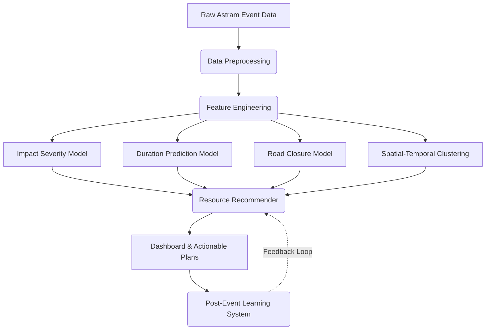

# Event-Driven Congestion: ML Pipeline for Traffic Impact Forecasting & Resource Optimization

## 🚦 Executive Summary

This project is an end-to-end Machine Learning prototype that predicts event-related traffic impact (congestion, duration, severity) in Bengaluru and recommends optimal **manpower**, **barricading**, and **diversion plans**. Built on the Astram traffic event dataset, this system acts as a smart orchestrator that translates raw traffic event data into highly actionable, cost-aware resource deployment strategies for traffic police and city planners.

## 🏗️ Architecture & Data Flow

The system is designed as a modular pipeline that processes raw data into automated resource plans. 



### 1. Data Preprocessing
The pipeline starts by cleaning and standardizing the Astram dataset:
- Standardizes datetime fields to IST (Asia/Kolkata).
- Fixes inconsistent categorical text (e.g., standardizing event causes).
- Imputes missing coordinates using corridor-level averages.
- Defines clear targets for ML models:
  - `priority_binary`: High vs. Low severity.
  - `resolution_hours`: Time taken to resolve the event.
  - `road_closure_binary`: Whether the event required a road closure.

### 2. Feature Engineering (55+ Features)
The system automatically generates a rich feature set to capture complex traffic dynamics:
- **Temporal Dynamics**: Rush hour flags, day/night indicators, weekend flags, and cyclical encoding of hours/days.
- **Spatial Context**: H3 hexagonal indexing (resolution 8) for spatial binning, distance to city center, and corridor/zone statistics.
- **Historical Lags**: Number of events in the same corridor in the last 24h/7days to capture compounding congestion.
- **Target Encoding**: Smooth target encoding for high-cardinality categorical variables like `corridor` and `junction`.

### 3. Machine Learning Models
The core of the prototype relies on four complementary predictive tasks:

| Model | Task | Architecture | Details |
|-------|------|-------------|------------|
| **Impact Severity** | Classify High/Low Impact | Stacked Ensemble | Combines LightGBM, XGBoost, CatBoost, and Random Forest using Logistic Regression as a meta-learner. Evaluated via ROC-AUC. |
| **Resolution Duration** | Predict Resolution Time | LightGBM Quantile Regressor | Predicts the mean duration *plus* uncertainty intervals (P10, P25, P50, P75, P90). We specifically fine-tuned this model with robust regularization to optimize MAE and 80%/50% Prediction Interval (PI) Coverage. |
| **Road Closure** | Binary Closure Prediction | CatBoost Classifier | Utilizes balanced class weights to predict rare road closure events. Evaluated via F1 and Recall to ensure no closures are missed. |
| **Hotspot Discovery** | Cluster Event Hotspots | HDBSCAN | Unsupervised spatial-temporal clustering to identify recurring congestion zones and high-risk clusters. |

### 4. Actionable Resource Recommender
Instead of just providing raw probabilities, the system translates ML outputs into physical world actions:
- **Alert Levels**: Maps severity to Green/Blue/Yellow/Red alert levels.
- **Manpower Planning**: Calculates required personnel based on base event cause, scaled by rush hour, severity, and closure multipliers. Computes total shifts needed based on the predicted *duration*.
- **Barricading**: Recommends the number of barricades needed based on whether a full, partial, or no closure is predicted.
- **Diversion Plans**: Suggests pre-computed Bengaluru-specific alternate routes.
- **Cost Estimation**: Estimates the operational cost of the recommended deployment.

### 5. Post-Event Learning System (Feedback Loop)
A novel addition to the prototype is the automated learning loop. 
- After an event resolves, the system compares its predictions against actual outcomes.
- It calculates bias (e.g., "The model consistently under-predicts duration for tree falls by 20%").
- It automatically generates **Correction Factors** that update the multipliers in the Resource Recommender, ensuring the system becomes smarter over time without requiring manual model retraining.

---

## 💻 Dashboard Interface

The prototype includes an interactive Streamlit dashboard (`dashboard/app.py`) that acts as the control center for operators.
- **Live Event Simulation**: Allows operators to input new events and instantly receive predicted severity, duration ranges, and complete resource deployment plans.
- **War Room (Live Simulation)**: A real-time event simulation timeline that auto-generates an incident scenario, runs AI analysis, dispatches resources on a live map second-by-second, and shows a Cost Savings comparison against naive deployment — all animated in real-time.
- **Hotspot Visualization**: Interactive maps displaying historical event clusters.
- **Model Explainability**: SHAP value plots explaining *why* the models made specific predictions.
- **Automated PDF Reporting**: Instantly generates an ultra-premium, dashboard-styled PDF report detailing the AI's impact predictions, complete resource action plan, suggested diversion routes, and itemized cost breakdown with visualizations.
- **Cost Savings Calculator**: Every simulation and prediction calculates the financial savings of AI-optimized deployment vs. a naive "send maximum resources" approach.
- **Post-Event Analytics**: Dashboards tracking the accuracy of the models over time.

---

## 🚀 Quick Start & Installation

### 1. Install Dependencies
Make sure you have Python 3.9+ installed.
```bash
pip install -r requirements.txt
```

### 2. Run the Training Pipeline
To execute data preprocessing, feature engineering, and model training/evaluation:
```bash
python -m src.pipeline
```
*Note: The pipeline uses a temporal train/test split (Train on events before March 2024, Test on events after) to accurately simulate real-world production performance.*

### 3. Launch the Dashboard
To start the interactive web interface:
```bash
streamlit run dashboard/app.py
```

---

## 📂 Project Structure

```text
├── src/
│   ├── data_preprocessing.py           # Data cleaning & target creation
│   ├── feature_engineering.py          # 55+ engineered features
│   ├── eda_visualizations.py           # Exploratory data analysis scripts
│   ├── resource_recommender.py         # Manpower/barricading/diversion plans
│   ├── post_event_learning.py          # Feedback loop & correction factors
│   ├── pdf_generator.py                # Premium PDF report generation (ReportLab)
│   ├── pipeline.py                     # End-to-end orchestrator
│   ├── tune_duration_model.py          # RandomizedSearch hyperparameter tuning
│   └── models/
│       ├── impact_severity_model.py    # Stacked ensemble architecture
│       ├── duration_model.py           # LightGBM Quantile regression
│       ├── road_closure_model.py       # Closure prediction
│       └── spatial_temporal_clustering.py  # HDBSCAN clustering
├── dashboard/
│   └── app.py                          # Streamlit interactive dashboard UI
├── outputs/
│   ├── models/                         # Saved .joblib model artifacts
│   ├── plots/                          # Saved EDA visualizations
│   └── reports/                        # Performance & post-event JSON reports
├── config.yaml                         # Global hyperparameter & pipeline config
├── requirements.txt
└── README.md
```

## 💡 Key Innovations summary

1. **Multi-Task Learning**: 4 complementary prediction tasks provide holistic event understanding.
2. **Quantile Duration Estimation**: We don't just predict a single number for duration; we predict uncertainty bands (P10–P90) which is critical for risk-averse resource planning.
3. **Post-Event Learning Loop**: Auto-generates correction factors from prediction errors.
4. **Actionable Resource Recommendations**: Converts abstract ML probabilities into concrete deployment plans (personnel, barricades, cost estimates).
5. **Automated Command Reports**: On-the-fly generation of premium, visually-rich PDF Action Plan reports for immediate dispatch.
